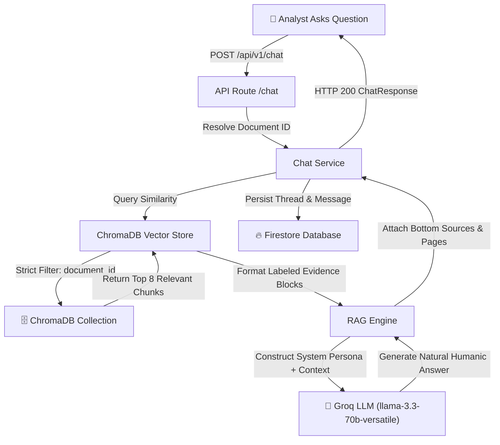

# FinSight AI — Architecture, Performance & Complete Workflow Guide

FinSight AI is a production-grade, local-first Financial Report Intelligence platform powered by Retrieval-Augmented Generation (RAG). It enables financial analysts to upload massive corporate filings (10-K, 10-Q, annual reports up to 600+ pages / 200MB) and interact with them in natural, conversational language with 100% source-grounded accuracy.

---

## 1. High-Level System Architecture

```mermaid
graph TD
    User["👤 Financial Analyst (Browser)"] -->|1. Upload 600+ Page PDF| Frontend["⚡ React + Vite Frontend"]
    Frontend -->|2. POST /api/v1/documents/upload| FastAPI["🚀 FastAPI Server (Port 8000)"]
    FastAPI -->|3. Save to Local Disk & SHA-256 Check| Disk["📁 Local Disk Storage (uploads/)"]
    FastAPI -->|4. Return Job Record & HTTP 200 Instant| Frontend
    
    FastAPI -->|5. Submit Job to Queue| Worker["⚙️ Local Background Worker Pool (ThreadPoolExecutor)"]
    
    subgraph Background Worker Execution
        Worker -->|6. Batch Page Extraction (PyMuPDF)| Extractor["📄 PDF Extractor"]
        Extractor -->|7. Selective OCR (Scanned Only)| OCR["👁️ OCR Service (Gemini Vision)"]
        OCR -->|8. Table & Layout Chunking| Chunker["🧩 Financial Chunker"]
        Chunker -->|9. SentenceTransformers Batch Embeddings| Embedder["🧠 SentenceTransformers (all-MiniLM-L6-v2)"]
        Embedder -->|10. Incremental Batch Upsert| ChromaDB["🗄️ ChromaDB Vector Database"]
    end

    Frontend -->|11. Poll GET /status (3s)| FastAPI
    FastAPI -->|12. Return Real-Time Progress 0-100%| Frontend
    Worker -->|13. Status = READY| Firestore["🔥 Firestore Document Status"]
```

---

## 2. RAG Question Answering Flowchart



---

## 3. Core Architectural Principles & Optimizations

### A. Non-Blocking Fast Upload (< 1 Second Response)
- **Problem**: Previously, uploading a 600-page PDF waited for PDF parsing, OCR, vector embedding, and ChromaDB insertion inside the single HTTP request, causing 300,000ms timeouts (`AxiosError: timeout exceeded`).
- **Solution**: The `POST /api/v1/documents/upload` endpoint performs **only lightweight pre-flight operations**:
  1. Authenticates the Firebase user.
  2. Streams file directly to local disk (`uploads/<user_id>/<document_id>/filename.pdf`) in 1MB chunks to keep RAM usage flat.
  3. Computes SHA-256 hash. If an identical file was previously indexed, it instantly reuses the indexed vectors.
  4. Creates the document record with `status="processing"` and `currentStage="Queued"`.
  5. Offloads the heavy extraction to `submit_background_processing()` on a dedicated background worker pool.
  6. **Returns HTTP 200 OK immediately** (< 1 second) with the `document_id`.

---

### B. Local Background Worker Thread Pool
- Heavy PDF extraction, OCR, sentence embeddings, and ChromaDB writes run on a dedicated Python `ThreadPoolExecutor(max_workers=2)`.
- This isolates CPU-bound processing from FastAPI's main async HTTP event loop.
- **Result**: While a 600+ page PDF is being indexed, normal API requests (`GET /dashboard`, `GET /reports`, `GET /conversations`, `GET /analytics`) respond instantly (< 50ms) without lagging.

---

### C. Selective OCR Engine
- Does **NOT** run OCR on every page.
- Native text extraction (via PyMuPDF `fitz`) is attempted first.
- If a page has sufficient native text (> 40 characters), OCR is skipped.
- OCR runs **only on verified scanned image-only pages**, saving up to 95% of unnecessary API calls.

---

### D. Memory-Controlled Batching (20 Pages / Batch)
- 600-page filings are extracted and chunked in controlled batches of 20 pages.
- SentenceTransformer embeddings are generated in batches of 32 chunks.
- Vector upserts to ChromaDB are committed in batches of 250 chunks.
- Memory garbage collection (`gc.collect()`) runs between batches to prevent RAM buildup on developer machines.

---

### E. Frontend Navigation Independence & Status Polling
- When a document is uploaded, the frontend receives the `document_id` and unlocks immediately.
- The user can navigate to **Dashboard**, **My Reports**, **AI Analyst**, **Compare Filings**, **Analytics**, or **Settings** while processing continues in the background.
- `ReportContext.tsx` maintains a non-blocking 3-second status polling loop (`GET /api/v1/documents/{document_id}/status`) that updates progress bars (`0-100%`) in real-time across the app header banner.

---

## 4. End-to-End Execution Sequence

1. **User Uploads PDF**: Selected PDF is sent to `POST /api/v1/documents/upload`.
2. **File Streamed to Disk**: Saved to `uploads/<user_id>/<document_id>/<filename>`.
3. **Instant HTTP Response**: Server responds with `status="processing"`, `progressPercent=5`.
4. **Background Task Enqueued**: Worker starts `process_document_background`.
5. **Pre-flight & Extraction**:
   - `Analyzing` (15%): PyMuPDF inspects layout, page count, and table density.
   - `Extracting` (30%): Text & tables extracted in 20-page batches.
   - `OCR` (45%): Applied only to scanned image-only pages.
   - `Chunking` (60%): Text split into 800-character semantic chunks with overlap.
   - `Embedding` (75%): `all-MiniLM-L6-v2` computes 384-dimensional vector embeddings.
   - `Indexing` (90%): Upserted into ChromaDB with `document_id` and `user_id` metadata.
   - `Ready` (100%): Document marked `status="completed"`.
6. **Grounded Q&A**: User questions are answered by retrieving top vector matches from ChromaDB and synthesizing natural analyst responses using Groq's `llama-3.3-70b-versatile` LLM. Page citations are appended cleanly at the bottom (`Sources: Page 4, Page 12`).

---

## 5. Summary of Key Files

| Module | File Path | Function |
|---|---|---|
| **Background Queue** | `backend/app/services/background_worker.py` | Local threadpool worker queue for non-blocking execution |
| **Document Service** | `backend/app/services/document_service.py` | Disk storage, SHA-256 hash reuse, stage tracking, background pipeline |
| **Upload API** | `backend/app/routes/documents.py` | Instant non-blocking HTTP upload endpoint & status polling API |
| **PDF Extractor** | `backend/app/document_processing/pdf_extractor.py` | Pre-flight inspection & batched page extraction |
| **Vector Engine** | `backend/app/vectorstore/vector_service.py` | SentenceTransformers embedding generation & ChromaDB indexing |
| **RAG Engine** | `backend/app/rag/rag_service.py` | Evidence retrieval, multi-query expansion, Groq LLM synthesis |
| **Frontend State** | `frontend/src/context/ReportContext.tsx` | Global report state, non-blocking upload, background status polling |
| **Header Progress** | `frontend/src/components/Header.tsx` | Real-time background processing progress banner |
