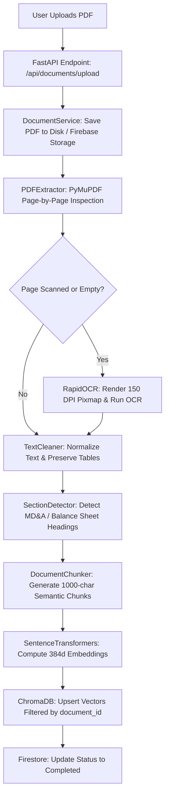
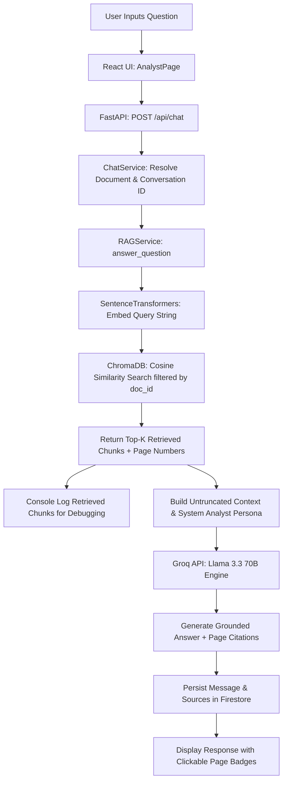

# 🚀 FinSight AI — Financial Report Intelligence Workspace

> **An Enterprise-Grade Grounded Financial Report Analysis & RAG Intelligence Platform**
> 
> *Built with FastAPI, PyMuPDF, RapidOCR, ChromaDB, Sentence-Transformers, Groq AI (Llama 3.3 70B), React, TypeScript, and Recharts.*

---

## 📌 Project Overview

**FinSight AI** is a state-of-the-art AI-powered financial intelligence workspace designed to analyze corporate financial statements, 10-K filings, annual reports, and scanned auditor statements. 

By combining **Retrieval-Augmented Generation (RAG)** with **Groq AI's ultra-fast LPU inference**, FinSight AI enables financial analysts, auditors, CFOs, and investors to upload complex documents and instantly get **accurate, grounded answers backed by verifiable page citations**, automated CFO executive summaries, and interactive financial data charts.

---

## 🎯 Problem Statement & Solution

### ❌ The Problem
* **Massive Volume & Complexity**: Annual reports (10-K, 10-Q, Audit Statements) are 50 to 400 pages long, filled with dense footnotes, multi-column tables, and scanned auditor signatures.
* **Time-Consuming Manual Analysis**: Financial analysts spend hours manually searching for specific figures like Net Profit, Operating Margins, Revenue breakdown, and Contingent Liabilities.
* **LLM Hallucinations & Memory Limits**: Standard LLMs (like standard ChatGPT) suffer from hallucinations, invent numbers when uncertain, or cannot process 400-page private PDFs directly due to context limits.

### ✅ The FinSight AI Solution
* **Hybrid Text & OCR Extraction**: Seamlessly extracts text from both native digital PDFs and scanned image pages using PyMuPDF and RapidOCR.
* **Grounded RAG Q&A Engine**: Restricts answers strictly to evidence retrieved from the uploaded document, eliminating hallucinations.
* **Exact Page Citations**: Every generated response includes verifiable page citations (e.g. `Sources: Page 4, Page 12`).
* **Automated CFO Executive Summaries**: Generates structured executive summaries, key highlights, and risk factors in valid JSON.
* **Interactive Financial Analytics**: Auto-extracts time-series financial metrics and renders interactive charts (Revenue, Net Profit, Assets vs. Liabilities, Cash Flows) using Recharts.

---

## 🛠️ Tools, Technologies & Purpose

| Category | Tool / Technology | Purpose & Role in FinSight AI |
| :--- | :--- | :--- |
| **Backend Framework** | **Python 3.12 & FastAPI** | Asynchronous, high-speed REST API engine handling PDF uploads, RAG queries, analytics extraction, and session management. |
| **LLM Inference** | **Groq AI (Llama 3.3 70B / Compound)** | Ultra-fast LLM inference API delivering natural analyst responses, CFO summaries, and JSON metric extractions. |
| **Vector Store** | **ChromaDB** | Local persistent vector database storing chunk embeddings and executing top-K similarity search scoped by `document_id`. |
| **Embedding Model** | **Sentence-Transformers (`all-MiniLM-L6-v2`)** | Converts document text chunks into 384-dimensional dense vector embeddings for semantic search. |
| **PDF Parser** | **PyMuPDF (`fitz`)** | High-performance page-by-page PDF reader for text, metadata, table bounding boxes, and image extractions. |
| **OCR Engine** | **RapidOCR (`rapidocr-onnxruntime`)** | ONNX-powered optical character recognition engine that extracts text from scanned or image-only PDF pages. |
| **Text Splitter** | **LangChain RecursiveCharacterTextSplitter** | Segments extracted text into overlapping semantic blocks (1000 characters, 200 overlap) with metadata. |
| **Database & Auth** | **Firebase Firestore & Storage** | Stores user auth data, document metadata, and multi-turn chat history. |
| **Frontend UI** | **React 18, Vite, TypeScript** | Modern single-page application delivering an interactive, responsive dashboard. |
| **Styling & Icons** | **TailwindCSS & Lucide Icons** | Professional dark/light modern financial dashboard design system. |
| **Data Visualization** | **Recharts** | Renders interactive financial charts for revenue trends, net profit margins, cash flows, and balance sheet metrics. |

---

## 🔥 Key Features

> [!TIP]
> **Core Capabilities at a Glance:**
> 1. **Grounded RAG Analyst Q&A**: Ask any question and receive evidence-backed answers with exact page numbers.
> 2. **OCR Scanned Document Processing**: Reads image-based scanned financial PDFs without dropping pages.
> 3. **CFO Executive Summaries**: One-click extraction of performance summaries, key highlights, and business risks.
> 4. **Financial Analytics Dashboard**: Auto-extracts numerical metrics into visual time-series charts.
> 5. **Multi-Thread Chat History**: Persistent chat threads organized per document.

---

## 📊 Project Flowcharts & System Architecture

### 1. Document Ingestion & Vector Indexing Flowchart

#### 🗺️ Visual Text Flowchart
```
  ┌────────────────────────────────────────────────────────┐
  │ 1. USER UPLOADS PDF (e.g. DSSPL Financial Statement)   │
  └───────────────────────────┬────────────────────────────┘
                              │
                              ▼
  ┌────────────────────────────────────────────────────────┐
  │ 2. FASTAPI BACKEND RECEIVES FILE & STORES IN DISK/FIREBASE │
  └───────────────────────────┬────────────────────────────┘
                              │
                              ▼
  ┌────────────────────────────────────────────────────────┐
  │ 3. PYMUPDF EXTRACTS PAGES & INSPECTS TEXT CHARACTER COUNT│
  └───────────────────────────┬────────────────────────────┘
                              │
               ┌──────────────┴──────────────┐
               │ Is Page Text Empty/Scanned? │
               └──────────────┬──────────────┘
                      │              │
             YES (Scanned Page)   NO (Digital Text)
                      │              │
                      ▼              │
  ┌──────────────────────────────┐   │
  │ RAPIDOCR: RENDER PAGE PIXMAP │   │
  │ AND RUN ONNX OCR EXTRACTION   │   │
  └──────────────┬───────────────┘   │
                 └────────────┬──────┘
                              │
                              ▼
  ┌────────────────────────────────────────────────────────┐
  │ 4. TEXT CLEANER: NORMALIZE SPACES & PRESERVE TABLES    │
  └───────────────────────────┬────────────────────────────┘
                              │
                              ▼
  ┌────────────────────────────────────────────────────────┐
  │ 5. DOCUMENT CHUNKER: SPLIT TEXT (1000 CHARS, 200 OVERLAP)│
  │    & ATTACH METADATA (doc_id, page_number, section)     │
  └───────────────────────────┬────────────────────────────┘
                              │
                              ▼
  ┌────────────────────────────────────────────────────────┐
  │ 6. SENTENCE-TRANSFORMERS GENERATES 384d EMBEDDINGS      │
  └───────────────────────────┬────────────────────────────┘
                              │
                              ▼
  ┌────────────────────────────────────────────────────────┐
  │ 7. CHROMADB: STORE VECTORS WITH STRICT doc_id SCOPING  │
  └────────────────────────────────────────────────────────┘
```

#### 🌐 Mermaid Flowchart Diagram


---

### 2. Grounded RAG Query Execution Flowchart

#### 🗺️ Visual Text Flowchart
```
  ┌────────────────────────────────────────────────────────┐
  │ 1. USER ASKS QUESTION: "What is the Net Profit?"      │
  └───────────────────────────┬────────────────────────────┘
                              │
                              ▼
  ┌────────────────────────────────────────────────────────┐
  │ 2. REACT FRONTEND SENDS POST /api/chat REQUEST         │
  └───────────────────────────┬────────────────────────────┘
                              │
                              ▼
  ┌────────────────────────────────────────────────────────┐
  │ 3. RAG SERVICE EMBEDS QUERY WITH SENTENCE-TRANSFORMERS  │
  └───────────────────────────┬────────────────────────────┘
                              │
                              ▼
  ┌────────────────────────────────────────────────────────┐
  │ 4. CHROMADB VECTOR SEARCH (Top-K=8, filtered by doc_id) │
  └───────────────────────────┬────────────────────────────┘
                              │
                              ▼
  ┌────────────────────────────────────────────────────────┐
  │ 5. SERVER LOGS RETRIEVED CHUNKS (Page #, Score, Text)  │
  └───────────────────────────┬────────────────────────────┘
                              │
                              ▼
  ┌────────────────────────────────────────────────────────┐
  │ 6. CONTEXT BUILDER ASSEMBLES FULL UNTRUNCATED EVIDENCE │
  │    + SYSTEM PROMPT (Analyst Persona)                   │
  └───────────────────────────┬────────────────────────────┘
                              │
                              ▼
  ┌────────────────────────────────────────────────────────┐
  │ 7. GROQ LLM (Llama 3.3 70B) SYNTHESIZES ANSWER          │
  └───────────────────────────┬────────────────────────────┘
                              │
                              ▼
  ┌────────────────────────────────────────────────────────┐
  │ 8. RETURN ANSWER + CLICKABLE PAGE CITATIONS TO UI     │
  └────────────────────────────────────────────────────────┘
```

#### 🌐 Mermaid Flowchart Diagram


---

## 📁 File Structure & Plain Language Explanation

```
FINANCE_REPORT_ANALYZER_AI/
│
├── backend/                                   # Python FastAPI Backend System
│   ├── app/
│   │   ├── api/
│   │   │   └── deps.py                        # Auth dependency (validates JWT tokens)
│   │   │
│   │   ├── config/
│   │   │   └── settings.py                    # Environment settings (API keys, chunk sizes, ChromaDB path)
│   │   │
│   │   ├── document_processing/               # PDF & Text Processing Pipeline
│   │   │   ├── pdf_extractor.py               # Page-by-page PDF parser using PyMuPDF
│   │   │   ├── ocr_extension.py               # RapidOCR handler for scanned image pages
│   │   │   ├── cleaner.py                     # Cleans text while preserving numbers & table formatting
│   │   │   ├── section_detector.py            # Identifies sections (e.g., MD&A, Balance Sheet)
│   │   │   ├── chunker.py                     # Splits text into 1000-char overlapping semantic blocks
│   │   │   └── processor.py                   # Master orchestrator combining PDF extraction, OCR, & chunking
│   │   │
│   │   ├── vectorstore/                       # Embedding & Vector Database Layer
│   │   │   ├── embeddings.py                  # Sentence-Transformers embedding loader (`all-MiniLM-L6-v2`)
│   │   │   ├── chroma_client.py               # Persistent ChromaDB connection singleton
│   │   │   └── vector_service.py              # Adds, searches, and deletes document vectors in ChromaDB
│   │   │
│   │   ├── llm/
│   │   │   └── llm_client.py                  # Groq API client with fallback candidate model handling
│   │   │
│   │   ├── rag/                               # RAG Engine Core
│   │   │   ├── prompts.py                     # System prompts for analyst persona & JSON extraction
│   │   │   ├── pipeline.py                    # Legacy pipeline wrapper
│   │   │   └── rag_service.py                 # Core RAG engine (Vector Search + Context + Groq Generation)
│   │   │
│   │   ├── services/                          # Business Logic Services
│   │   │   ├── document_service.py            # File uploads, Firestore sync, & auto OCR re-indexing
│   │   │   ├── chat_service.py                # Manages conversation history & message persistence
│   │   │   ├── summary_service.py             # Generates CFO executive summaries & highlights
│   │   │   └── financial_service.py           # Extracts structured time-series metrics for charts
│   │   │
│   │   ├── routes/                            # FastAPI REST API Endpoints
│   │   │   ├── api_router.py                  # Router combining all API endpoints
│   │   │   ├── chat.py                       # POST /api/chat (RAG Q&A and history)
│   │   │   ├── documents.py                  # POST /api/documents/upload & deletion
│   │   │   ├── reports.py                    # GET /api/reports/{id}/summary
│   │   │   └── financials.py                 # GET /api/financials/{id}/metrics
│   │   │
│   │   └── main.py                            # Application entry point & CORS setup
│   │
│   ├── tests/
│   │   └── test_rag.py                        # Automated unit tests for RAG engine validation
│   └── requirements.txt                       # Backend Python package manifest
│
└── frontend/                                  # React + TypeScript Frontend System
    ├── src/
    │   ├── components/                        # UI Components
    │   │   ├── Navbar.tsx                     # Top navigation bar
    │   │   ├── Sidebar.tsx                    # Left menu navigation sidebar
    │   │   ├── CitationBadge.tsx              # Interactive clickable source page badge
    │   │   └── MetricCard.tsx                 # KPI metric display card
    │   │
    │   ├── pages/                             # Screen Views
    │   │   ├── HomePage.tsx                   # Public landing page
    │   │   ├── UploadPage.tsx                 # PDF drag-and-drop upload screen
    │   │   ├── AnalystPage.tsx                # Grounded RAG Chat Q&A workspace
    │   │   ├── ReportSummaryPage.tsx          # CFO executive summary view
    │   │   └── AnalyticsPage.tsx              # Interactive financial charts view
    │   │
    │   ├── services/
    │   │   └── api.ts                         # Axios API client connecting to FastAPI backend
    │   │
    │   ├── App.tsx                            # React router & page layout configuration
    │   └── main.tsx                           # React DOM mount script
    │
    ├── tailwind.config.js                     # Tailwind CSS styling configuration
    └── package.json                           # Frontend NPM dependencies & scripts
```

---


### Q1: What is FinSight AI and what problem does it solve?
**Answer**: FinSight AI is an AI-powered financial report intelligence platform. It solves the problem of manually reading through 50–400 page corporate financial reports. By combining **OCR, RAG, and Groq AI**, it enables users to upload PDFs and instantly get grounded Q&A answers with page citations, automated CFO summaries, and visual analytics charts.

---

### Q2: Why did you use RAG (Retrieval-Augmented Generation) instead of fine-tuning an LLM?
**Answer**: 
1. **Zero Hallucinations**: Fine-tuning does not prevent an LLM from hallucinating numbers. RAG strictly forces the model to generate answers using retrieved document context.
2. **Instant Document Updating**: Fine-tuning requires hours of retraining for new PDFs. RAG indexes a new PDF in seconds into ChromaDB.
3. **Verifiable Citations**: RAG allows linking answers back to exact source page numbers (`Page 4, Page 12`).

---

### Q3: How did you solve the problem of scanned image PDFs that have no digital text?
**Answer**: Standard PDF parsers return empty text when reading scanned PDFs. I built a hybrid extraction pipeline using **PyMuPDF** and **RapidOCR**. When PyMuPDF detects 0 or low character counts on a page, it renders a 150 DPI page pixmap and runs RapidOCR (`rapidocr-onnxruntime`). This extracts text from scanned image pages seamlessly so they can be indexed into ChromaDB.

---

### Q4: How does ChromaDB vector retrieval work in your application?
**Answer**: During ingestion, text chunks are converted into 384-dimensional vector embeddings using `sentence-transformers/all-MiniLM-L6-v2` and stored in ChromaDB with metadata (`user_id`, `document_id`, `page_number`, `section`). During a query, the query text is embedded and ChromaDB performs cosine similarity search filtered strictly by `document_id` to retrieve top-K matching chunks.

---

### Q5: How do you enforce multi-tenant user and document data security?
**Answer**: 
1. **ChromaDB Level**: Vector search calls include `where={"document_id": document_id}`. If 0 chunks match the requested document ID, the system returns 0 chunks rather than leaking data from other documents.
2. **Firestore Level**: All user document and conversation records are filtered by `userId == current_user['uid']`.

---

### Q6: Why did you choose Groq AI over OpenAI?
**Answer**: Groq uses LPU (Language Processing Unit) architecture, offering ultra-fast inference speeds (500+ tokens/sec). This makes financial Q&A and complex JSON analytics extraction feel instant. Groq also provides access to Llama 3.3 70B, which offers top-tier financial reasoning capability.

---

### Q7: What was a major technical issue you encountered and how did you fix it?
**Answer**: 
* **Issue**: Uploaded scanned financial statements were returning *"I couldn't find enough information..."* because PyMuPDF extracted 0 text, causing pages to be discarded, and an artificial 600-character context limit was truncating financial numbers.
* **Fix**: Integrated RapidOCR for scanned image pages, removed artificial context truncation in `rag_service.py`, updated document re-indexing in `document_service.py`, and added chunk retrieval console debug logging.
